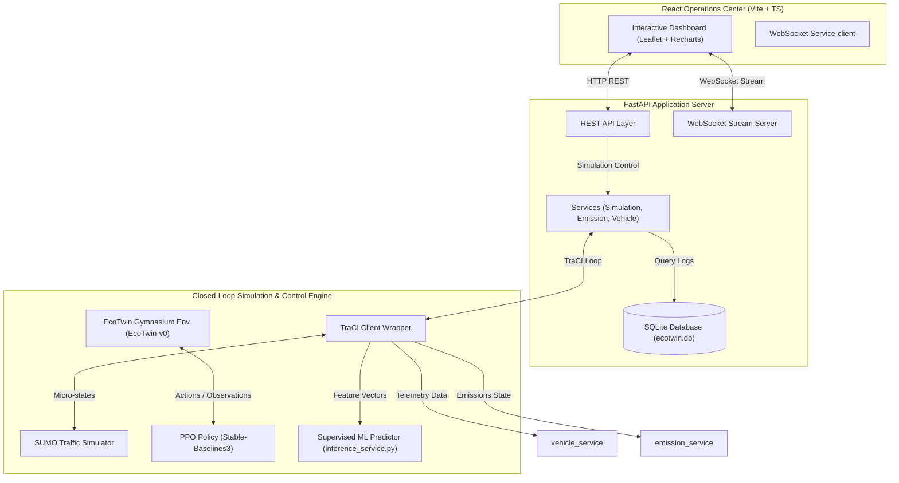
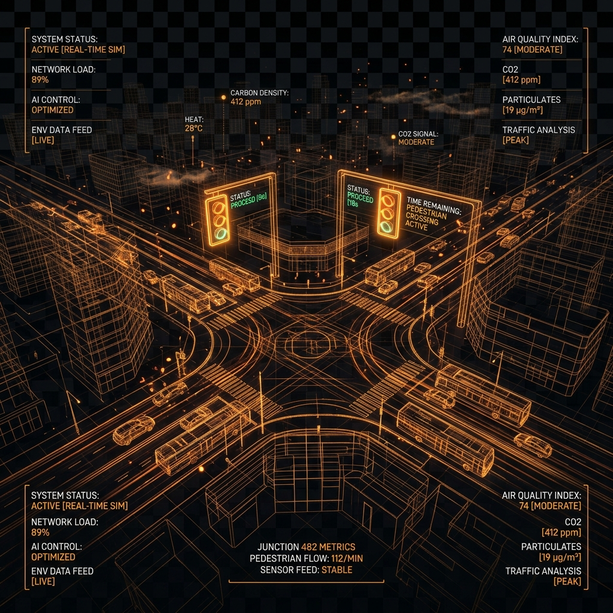

# EcoTwin
### Intelligent Urban Traffic & Carbon Intelligence Platform

EcoTwin is a microscopic urban digital-twin platform that couples high-fidelity traffic simulation, deep reinforcement learning, and real-time telemetry pipelines to optimize traffic signal schedules, alleviate road congestion, and analyze vehicular emission dynamics in real time.

---

## Overview

Modern municipal traffic grids face a critical, dual-objective challenge: mitigating extreme vehicular delays and curbing localized environmental pollution. Traditional traffic signal controllers—relying on static fixed schedules or reactive inductive loop actuators—fail to respond dynamically to irregular flow patterns and do not account for tailpipe emissions. 

**EcoTwin** acts as an operations dashboard and a closed-loop control system. By interfacing **Eclipse SUMO (Simulation of Urban MObility)** with a **FastAPI** backend and a high-performance **React** frontend, it overrides signal junctions on the fly using a deep reinforcement learning policy (PPO). Through its real-time telemetry pipeline, EcoTwin streams high-frequency coordinates, speeds, delays, and emissions over WebSockets, transforming simulation data into actionable carbon intelligence.

---

## Why EcoTwin?

- **Decoupled Architecture**: Separation between the high-fidelity SUMO simulation engine, the FastAPI async server, and the glassmorphic React operations dashboard.
- **Closed-Loop Control**: Direct bi-directional command of traffic signals using TraCI, switching between a fixed-time baseline and a PPO optimization model in real time.
- **Integrated Carbon Mapping**: Instantaneous aggregation of vehicle positions into spatial coordinates to map localized pollution hotspots (CO₂ and NOx).
- **Comparative Run Benchmarking**: Database-backed telemetry analysis to compare and contrast PPO runs against fixed-time baselines across key metrics.

---

## Problem Statement

Conventional signal optimization methods seek to maximize vehicle throughput, ignoring the environmental impact of idling queues. As vehicles halt, decelerate, and accelerate at intersections, emissions spike dramatically. An intelligent traffic system must answer a central engineering question: **Can traffic control decisions improve urban mobility while simultaneously reducing environmental pollution?** EcoTwin provides the digital-twin and control pipeline to explore and solve this multi-objective optimization problem.

---

## What EcoTwin Does

1. **Simulates microscopic traffic**: Tracks individual vehicle movements, speeds, lane positioning, and idling times in detailed urban networks (including the Cologne scenario).
2. **Preloads and runs policies**: Integrates Stable-Baselines3 PPO models to override traffic signal states based on approach queues.
3. **Aggregates tailpipe emissions**: Reads vehicle-level carbon dioxide (CO₂), nitrogen oxides (NOx), and fuel consumption rates.
4. **Visualizes live telemetry**: Exposes a real-time web interface containing Leaflet maps, coordinate sweeps, performance dials, and carbon heatmaps.
5. **Benchmarks historical runs**: Commits simulation stats to an SQLite database for run comparisons.

---

## Core Capabilities

- **High-Frequency WebSocket Broadcasts**: Streams unified JSON simulation state frames (vehicle telemetry, signal phases, grid emissions) at $1\text{ Hz}$.
- **Multi-Objective RL Control**: Implements a Discrete action agent penalizing approach delay and cumulative tailpipe emissions.
- **Micro-Simulation Scenarios**: Supports distinct SUMO network profiles (`training`, `evaluation`, and `normal` city grids) as well as the Cologne dataset (`tapas_cologne`).
- **Project Insights Engine**: Features an active AST and metadata notebook parser, bringing data science research outputs directly into the frontend.

---

## System Architecture

The EcoTwin platform is designed around a decoupled, three-tier service layout:



---

## Runtime Data Flow

High-frequency telemetry and action execution loops operate on a step-by-step cycle:

```mermaid
sequenceDiagram
    autonumber
    participant SUMO as SUMO Simulator
    participant TraCI as TraCI Client
    participant Manager as Simulation Manager
    participant Services as Vehicle/Emission Services
    participant DB as SQLite DB
    participant WS as WebSocket Server
    participant Frontend as React Dashboard

    loop Simulation Step (dt = 0.1s)
        alt PPO Control Mode Active
            Manager->>TraCI: Get approach lanes state
            TraCI->>Manager: Return queue lengths & waiting times (8D vector)
            Manager->>Manager: Forward to PPO Policy Inference
            Note over Manager: model.predict(obs, deterministic=True)
            Manager->>TraCI: setPhase(tls_id, action_phase)
            TraCI->>SUMO: Override traffic signal phase (index 0-3)
        end
        
        Manager->>TraCI: step() (Advance simulation by step_length)
        SUMO->>TraCI: Update vehicle telemetry and emissions
        
        Manager->>Services: Update active caches
        Services->>TraCI: Query vehicle speeds, positions, CO2, NOx, fuel
        Services-->>Manager: Return cached telemetry updates
        
        rect rgb(15, 10, 5)
            Note over Manager, WS: Broadcast Interval (1s)
            Manager->>DB: Save MetricSnapshot (vehicles, speed, delay, CO2, NOx, fuel, reward)
            Manager->>WS: Push simulation_state JSON packet
            WS->>Frontend: Broadcast packet over WebSocket channel
            Frontend->>Frontend: Redraw Leaflet markers, Recharts charts, and gauges
        end
    end
```



---

## Reinforcement Learning Pipeline

EcoTwin features a closed-loop reinforcement learning pipeline using a custom Gymnasium wrapper.

```
+------------------------------------------------------------+
|                       Gymnasium Env                        |
|                                                            |
|  +-------------+     Observation Space     +------------+  |
|  |    SUMO     | ------------------------> | Observation|  |
|  | Simulation  |   (Queues, Wait Times)    |  Builder   |  |
|  +-------------+                           +------------+  |
|         ^                                        |         |
|         |                                        v         |
|   Apply Action                              8D State Vector|
|   (Discrete 0-3)                                 |         |
|         |                                        v         |
|  +-------------+                           +------------+  |
|  | Traffic     | <------------------------ | PPO Agent  |  |
|  | Lights Mgr  |       Phase Decision      |  (Policy)  |  |
|  +-------------+                           +------------+  |
|                                                            |
+------------------------------------------------------------+
```

### 1. Environment Details
- **Registration ID**: `EcoTwin-v0`
- **Source File**: [environment.py](file:///d:/Infotact_Solutions/EcoTwin/backend/rl/environment.py)
- **Algorithm**: Proximal Policy Optimization (PPO) via PyTorch and Stable-Baselines3.

### 2. Observation Space
An $8$-dimensional continuous vector (Gymnasium `Box` space scaled $[0.0, 100.0]$):
- **Features [0-3]**: Total halting vehicles (queues) on the 4 approaches controlled by the traffic junction.
- **Features [4-7]**: Normalized accumulated vehicle waiting times (divided by $60.0$) on the 4 approach lanes.

### 3. Action Space
A discrete space (`Discrete(4)`) representing the targeted signal phase configs:
- `0`: North-South Green Phase (`GGGggrrrrrGGGggrrrrr`)
- `1`: North-South Yellow Phase (`yyyyyrrrrryyyyyrrrrr`)
- `2`: East-West Green Phase (`rrrrrGGGggrrrrrGGGgg`)
- `3`: East-West Yellow Phase (`rrrrryyyyyrrrrryyyyy`)

### 4. Reward Function
Multi-objective reward penalty optimizing traffic throughput while discouraging localized emissions:

$$\text{Reward} = - (\alpha \cdot \text{Delay Penalty} + \beta \cdot \text{Emission Penalty})$$

Where:
- **Delay Penalty**: Average accumulated approach lane waiting times divided by $100.0$.
- **Emission Penalty**: Cumulative approach lane emissions normalized:
  
  $$\text{Emission Penalty} = \frac{\text{CO}_2}{10000.0} + \frac{\text{NO}_x}{1000.0} + \frac{\text{PM}_{2.5}}{100.0}$$
  
- **Weights ($\alpha, \beta$)**: Read dynamically from [reward_config.json](file:///d:/Infotact_Solutions/EcoTwin/backend/config/reward_config.json) (Default: $\alpha = 0.6$ waiting time weight, $\beta = 0.4$ CO₂ weight).

---

## SUMO Digital Twin

EcoTwin structures its micro-simulation networks within `simulation/`. The configuration routes link networks, routes, vehicle characteristics, and emissions specs:

### 1. Directory Structure & Assets
- **Configurations** (`simulation/config/`):
  - `city.sumocfg`: Standard 3600-step run config.
  - `evaluation.sumocfg`: 2000-step scenario verification.
  - `training.sumocfg`: 1000-step config for faster RL iterations.
- **Network Files** (`simulation/network/`):
  - `city.net.xml`: XML road geometry, approach lanes, and junction definitions.
  - `city.nod.xml`, `city.edg.xml`: Node and edge layout configurations.
- **Route Files** (`simulation/routes/`):
  - `traffic.rou.xml`: Microscopic demand profile routing vehicles across the grid.
  - `vehicles.add.xml`: Definition of custom vehicle emission classes and types.
- **Emissions Configuration** (`simulation/emissions/`):
  - `emissions.add.xml`: SUMO additional config attaching HBEFA3 emission models.
- **Traffic Light Additions** (`simulation/traffic_lights/`):
  - `tls.add.xml`: Logic, signals, and default phase indices.
- **Cologne Scenario** (`simulation/tapas_cologne/`):
  - High-fidelity dataset including `cologne.net.xml`, `cologne.poly.xml`, and trip files for a large-scale urban network simulation.

### 2. Microscopic Simulation Pipeline
```
[city.net.xml] + [traffic.rou.xml] ---> [city.sumocfg] ---> [sumo / sumo-gui]
                                           + [emissions.add.xml]
```

---

## Traffic & Vehicle Telemetry

Vehicle data updates in a local memory cache in the `VehicleService` during each step:
- **Vehicle ID**: Unique identifier in simulation step.
- **Coordinates (x, y)**: Spatial coordinates mapping vehicle position.
- **Speed**: Velocity in km/h (mapped from SUMO's native m/s: $\text{mps} \times 3.6$).
- **Waiting Time**: Total elapsed duration in seconds where speed is $< 0.1\text{ m/s}$.
- **Emissions**:
  - `co2`: Instantaneous carbon dioxide emissions in mg/s.
  - `nox`: Instantaneous nitrogen oxides emissions in mg/s.
  - `fuel_consumption`: Instantaneous fuel usage rate in ml/s (approx from SUMO's mg/s divided by $740.0$).
- **Spatial Positioning**: Active `lane_id` and `road_id`.

This granular schema drives the map markers and charts on the React dashboard.

---

## Environmental Intelligence

EcoTwin exposes emission hotspots and carbon dispersal indices:
- **CO₂ Tracking**: Instantaneous rates pinpoint high-idle congestion sectors.
- **NOx Index**: Maps toxic nitrogen oxide emissions, critical in dense residential zones.
- **Hotspot Analysis**: Evaluates lanes against thresholds defined in [constants.py](file:///d:/Infotact_Solutions/EcoTwin/backend/core/constants.py):
  - $\text{CO}_2 > 100,000\text{ mg/s}$
  - $\text{NO}_x > 1,000\text{ mg/s}$
  - $\text{PM}_{2.5} > 100\text{ mg/s}$
- **Pollution Grid Aggregation**: Groups vehicle positions into $50\text{m} \times 50\text{m}$ spatial grid cells. An intensity score ($0.0$ to $1.0$) is calculated based on relative CO₂ values to render a carbon heatmap on the frontend Leaflet interface.

---

## Frontend Experience

The dashboard is built using a glassmorphic design system in React. The interface exposes these active pages:

1. **Landing View (`/`)**: Gateway page running system health verification checks.
2. **Overview Dashboard (`/overview`)**: Displays high-level stats, database summary charts, active controller labels, and performance summaries.
3. **Simulation Center (`/simulation`)**: Workspace containing the Leaflet digital-twin viewport map, step controllers (start, pause, resume, step, stop), and running telemetry dials.
4. **Traffic Network (`/traffic`)**: Focuses on approach lane queue lengths, signal phases, and junction statistics.
5. **Carbon Intelligence (`/carbon`)**: Spatial emission maps, pollution intensity grid cells, and lane-level hotspot lists.
6. **RL Control Panel (`/rl`)**: Policy state charts, latency checks, reward progress lines, and real-time controller toggle (Fixed-Time vs PPO).
7. **Analytics Suite (`/analytics`)**: Interface to compare active/completed run data with delta percentages.
8. **Project Insights (`/insights`)**: Displays file structural metadata, AST analyses, and Jupyter notebook summaries.
9. **Jupyter Experiments (`/compare`)**: Explores historical notebook runs, code scripts, and training configurations.
10. **System Health (`/health`)**: Component checks for SQLite DB, API server, SUMO installation path, and loaded model weights.
11. **Settings View (`/settings`)**: Adjusts default scenario names, ports, step speeds, and dashboard theme styles.

---

## API Architecture

The FastAPI server structures endpoints logically into routers registered under `/api/v1`:

```
backend/api/routes/
├── health.py          --> Health and readiness checks
├── simulation.py      --> SUMO process and session managers
├── vehicles.py        --> High-frequency vehicle queries
├── emissions.py       --> Hotspots, grid cells, and emission details
├── traffic_lights.py  --> Discovery, states, and phase overrides
├── rl.py              --> Policy metadata and control toggles
├── metrics.py         --> Historical session snapshots
├── analysis.py        --> Run comparisons
└── project.py         --> Notebook, AST, and report figure servers
```

---

## Run Comparison

EcoTwin handles comparative run benchmarking:

1. **Session ID Generation**: When a simulation starts, a unique UUID v4 is generated.
2. **Telemetry Archiving**: During every step, aggregated metrics are committed to `MetricSnapshot` database tables.
3. **Demo Runs Seeding**: To support immediate comparisons without running new simulations, the backend seeds two completed runs during start:
   - **PPO Run ID**: `dbd76ae5-cf2d-411a-bf2a-60db028b1859` (trained policy).
   - **Baseline Run ID**: `ca751717-38ee-4b92-a1f7-e4359cd4852c` (fixed-time schedule).
4. **Analytics Retrieval**: The `/api/v1/analysis/compare` endpoint retrieves the final completed snapshots and calculates percentage differences for delays, speed, fuel, and carbon.

---

## Project Structure

```
EcoTwin/
├── backend/
│   ├── api/
│   │   ├── routes/
│   │   │   ├── analysis.py
│   │   │   ├── emissions.py
│   │   │   ├── health.py
│   │   │   ├── metrics.py
│   │   │   ├── project.py
│   │   │   ├── rl.py
│   │   │   ├── simulation.py
│   │   │   ├── traffic_lights.py
│   │   │   └── vehicles.py
│   │   ├── router.py
│   │   └── websocket.py
│   ├── config/
│   │   ├── feature_config.json
│   │   └── reward_config.json
│   ├── core/
│   │   ├── config.py
│   │   ├── constants.py
│   │   ├── database.py
│   │   ├── lifecycle.py
│   │   ├── logging.py
│   │   └── seeding.py
│   ├── emissions/
│   │   ├── co2.py
│   │   ├── hotspot_detection.py
│   │   ├── nox.py
│   │   ├── pm25.py
│   │   └── pollution_index.py
│   ├── main.py
│   ├── ml/
│   │   ├── inference_service.py
│   │   └── model_loader.py
│   ├── models/
│   │   ├── orm.py
│   │   ├── responses.py
│   │   └── schemas.py
│   ├── optimization/
│   │   ├── actuated_control.py
│   │   ├── baseline_controller.py
│   │   ├── fixed_time.py
│   │   └── rl_controller.py
│   ├── rl/
│   │   ├── action_mapper.py
│   │   ├── action_space.py
│   │   ├── callbacks.py
│   │   ├── ecotwin_env.py
│   │   ├── environment.py
│   │   ├── evaluate.py
│   │   ├── inference.py
│   │   ├── observation_builder.py
│   │   ├── observation_space.py
│   │   ├── ppo_config.py
│   │   ├── ppo_service.py
│   │   ├── reward.py
│   │   ├── reward_components.py
│   │   ├── reward_service.py
│   │   └── train.py
│   ├── services/
│   │   ├── analytics_service.py
│   │   ├── metrics_service.py
│   │   ├── model_service.py
│   │   ├── project_service.py
│   │   └── simulation_service.py
│   ├── simulation/
│   │   ├── data_collector.py
│   │   ├── emission_collector.py
│   │   ├── emission_service.py
│   │   ├── manager.py
│   │   ├── simulation_controller.py
│   │   ├── sumo_manager.py
│   │   ├── traci_client.py
│   │   ├── traffic_light_controller.py
│   │   ├── traffic_lights.py
│   │   ├── traffic_state.py
│   │   └── vehicle_service.py
│   └── websocket/
│       ├── manager.py
│       └── simulation_stream.py
├── data/
│   ├── emissions/
│   ├── metadata/
│   ├── processed/
│   ├── raw/
│   └── simulation_runs/
├── docs/
│   ├── assets/
│   │   └── ecotwin-banner.svg
│   └── architecture.md
├── frontend/
│   ├── dist/
│   ├── public/
│   │   └── images/
│   │       ├── ecotwin-city-hero.png
│   │       └── ecotwin-twin-viewport.png
│   ├── src/
│   │   ├── api/
│   │   ├── components/
│   │   ├── hooks/
│   │   ├── pages/
│   │   ├── services/
│   │   │   └── websocket.ts
│   │   ├── store/
│   │   ├── types/
│   │   ├── utils/
│   │   ├── App.tsx
│   │   └── main.tsx
│   ├── package.json
│   ├── tailwind.config.js
│   └── tsconfig.json
├── models/
│   ├── ml/
│   │   ├── metadata.json
│   │   └── pollution_predictor.joblib
│   ├── ppo/
│   │   └── checkpoints/
│   ├── preprocessing/
│   │   └── feature_schema.json
│   ├── rl/
│   │   └── ppo/
│   │       └── best_model.zip
│   └── artifact_registry.json
├── notebooks/
│   ├── 01_dataset_audit.ipynb
│   ├── 02_data_cleaning_feature_engineering.ipynb
│   ├── 03_baseline_analysis.ipynb
│   ├── 04_carbon_spatial_analysis.ipynb
│   ├── 05_ml_baseline.ipynb
│   ├── 06_ecotwin_gym_environment.ipynb
│   ├── 07_fixed_time_baseline.ipynb
│   ├── 08_rl_environment_validation.ipynb
│   ├── 09_ppo_training.ipynb
│   ├── 10_ppo_evaluation.ipynb
│   ├── 11_carbon_dispersal_impact.ipynb
│   └── 12_final_model_report.ipynb
├── reports/
│   ├── figures/
│   │   ├── spatial/
│   │   │   ├── carbon_dispersal_comparison.png
│   │   │   └── carbon_spatial_heatmap.png
│   │   ├── average_speed_vs_time.png
│   │   ├── co2_distribution.png
│   │   ├── co2_vs_speed.png
│   │   ├── co2_vs_time.png
│   │   └── correlation_heatmap.png
│   ├── ppo_training/
│   │   └── improvements.json
│   ├── baseline_metrics.json
│   └── fixed_time_metrics.json
├── scratch/
│   ├── execute_all_notebooks.py
│   ├── generate_notebooks.py
│   └── inspect_data.py
├── scripts/
│   ├── evaluate_agent.py
│   ├── export_artifacts.py
│   ├── generate_report.py
│   ├── generate_routes.py
│   ├── run_sumo.py
│   ├── train_agent.py
│   └── validate_artifacts.py
├── tests/
├── docker-compose.yml
├── Dockerfile
├── Dockerfile.frontend
├── LICENSE
├── Makefile
├── pyproject.toml
└── requirements.txt
```

---

## Technology Stack

| Layer | Technology | Responsibility |
|---|---|---|
| **Frontend Core** | React 18.2 + Vite + TypeScript 5.0 | High-frequency telemetry dashboard |
| **State Management**| Zustand | Reactive client-side application state |
| **Styling** | Vanilla CSS + TailwindCSS | Glassmorphic interface styling |
| **Web Mapping** | Leaflet | Map layouts and spatial coordinates rendering |
| **Charts** | Recharts | Real-time time-series telemetry plots |
| **Backend Server** | FastAPI + Uvicorn | Async REST API & high-frequency WebSocket servers |
| **Database** | SQLite + SQLAlchemy ORM | Run session archiving and telemetry snapshots |
| **Traffic Engine** | Eclipse SUMO | Microscopic traffic simulation modeling |
| **Client-SUMO Link**| TraCI (Python API) | Closed-loop signal overriding and state queries |
| **Reinforcement Learning** | Gymnasium + Stable-Baselines3 (PPO) | Neural network optimization agent policies |
| **Machine Learning**| Scikit-learn + Joblib | Preprocessor and regression model loader |
| **Testing** | pytest | Integration and unit testing suite |

---

## Feature Matrix

| Capability | Status | Implementation Details |
|---|---|---|
| **Microscopic SUMO simulation** | ✅ Implemented | TraCI controls subprocesses across scenario CFGs |
| **Vehicle Telemetry Streaming**| ✅ Implemented | Real-time $x, y$ coordinates, speeds, lanes via WebSockets |
| **Emission Tracking** | ✅ Implemented | CO₂, NOx, and fuel consumption computed at each step |
| **Traffic-Light overrides** | ✅ Implemented | Dynamic phase configuration over approach lines via TraCI |
| **Fixed-Time Baseline Mode** | ✅ Implemented | Static cycle controllers based on XML signal phases |
| **PPO Policy Controller** | ✅ Implemented | PPO Agent overrides center junctions based on approach queues |
| **Live Telemetry WebSockets** | ✅ Implemented | Broadcasts JSON simulation frame packet at $1\text{ Hz}$ frequency |
| **Run Comparison Suite** | ✅ Implemented | SQLite database queries contrasting PPO and Baseline runs |
| **Carbon Heatmaps** | ✅ Implemented | Leaflet layer displaying spatial $50\text{m}$ grid intensities |
| **Jupyter Analytics Parser** | ✅ Implemented | Python service extracting AST and metadata from notebooks |
| **Docker Compose Deployment**| ✅ Implemented | Decoupled backend (with SUMO) and frontend containers |

---

## Current Implementation

- **Decoupled Asynchronous API**: FastAPI handles CORS, routes queries, connects ORM engines, and hosts WebSockets.
- **Bi-directional TraCI Bridge**: Controls SUMO instances synchronously in worker threads to prevent thread lockups.
- **Gymnasium State Mapping**: Transforms XML vehicle halts and delays into input state tensors.
- **Seeded Demo Analysis**: Startup triggers db seeding, providing a ready-to-test comparative analysis dataset.
- **AST Inspector**: Safely parses workspace python files and notebook nodes to populate the operations dashboard.

---

## Research & Notebooks

The `notebooks/` directory contains historical models, datasets, and performance audits:

| Notebook | Purpose | Used by Application? |
|---|---|---|
| [01_dataset_audit.ipynb](file:///d:/Infotact_Solutions/EcoTwin/notebooks/01_dataset_audit.ipynb) | Explores raw vehicles data formats | Historical Analysis |
| [02_data_cleaning_feature_engineering.ipynb](file:///d:/Infotact_Solutions/EcoTwin/notebooks/02_data_cleaning_feature_engineering.ipynb) | Feature selection for supervised models | Preprocessing |
| [03_baseline_analysis.ipynb](file:///d:/Infotact_Solutions/EcoTwin/notebooks/03_baseline_analysis.ipynb) | Evaluates emissions under static schedules | Base metrics reference |
| [04_carbon_spatial_analysis.ipynb](file:///d:/Infotact_Solutions/EcoTwin/notebooks/04_carbon_spatial_analysis.ipynb) | Determines coordinates for spatial grids | Heatmap validation |
| [05_ml_baseline.ipynb](file:///d:/Infotact_Solutions/EcoTwin/notebooks/05_ml_baseline.ipynb) | Trains Random Forest regression models | ML model generation |
| [06_ecotwin_gym_environment.ipynb](file:///d:/Infotact_Solutions/EcoTwin/notebooks/06_ecotwin_gym_environment.ipynb) | Early prototype of the Gymnasium class | Prototype only |
| [07_fixed_time_baseline.ipynb](file:///d:/Infotact_Solutions/EcoTwin/notebooks/07_fixed_time_baseline.ipynb) | Audits Fixed-Time schedules | Logic verification |
| [08_rl_environment_validation.ipynb](file:///d:/Infotact_Solutions/EcoTwin/notebooks/08_rl_environment_validation.ipynb) | Validates observations and rewards | Env testing |
| [09_ppo_training.ipynb](file:///d:/Infotact_Solutions/EcoTwin/notebooks/09_ppo_training.ipynb) | Trains PPO agents on training networks | RL model generation |
| [10_ppo_evaluation.ipynb](file:///d:/Infotact_Solutions/EcoTwin/notebooks/10_ppo_evaluation.ipynb) | Evaluates policies on evaluation networks | Model evaluation |
| [11_carbon_dispersal_impact.ipynb](file:///d:/Infotact_Solutions/EcoTwin/notebooks/11_carbon_dispersal_impact.ipynb) | Audits carbon reduction metrics | Report figures generator |
| [12_final_model_report.ipynb](file:///d:/Infotact_Solutions/EcoTwin/notebooks/12_final_model_report.ipynb) | Consolidates baseline vs PPO deltas | Report consolidated |

---

## Product Showcase

### 1. Operations Center Landing Gateway
Visualizes the landing screen and system health validations.


### 2. Live Digital-Twin Telemetry Viewport
Shows active vehicle tracking and real-time Leaflet simulation maps.


---

## Quick Start

Follow these steps to set up and run the complete application stack locally on Windows.

### 1. Prerequisites
- **Python 3.10+** (Tested with Python 3.10)
- **Node.js 18+** (with npm package manager)
- **Eclipse SUMO**: Ensure SUMO is installed locally.
  - Set the `SUMO_HOME` environment variable:
    ```powershell
    [Environment]::SetEnvironmentVariable("SUMO_HOME", "C:\Program Files (x86)\Eclipse\Sumo", "User")
    ```
  - Add `SUMO_HOME\bin` to your system `PATH`:
    ```powershell
    $existingPath = [Environment]::GetEnvironmentVariable("Path", "User")
    [Environment]::SetEnvironmentVariable("Path", "$existingPath;C:\Program Files (x86)\Eclipse\Sumo\bin", "User")
    ```

### 2. Clone the Repository
```powershell
git clone https://github.com/animesh6532/EcoTwin.git
cd EcoTwin
```

### 3. Configure Environment Variables
Copy `.env.example` to create your local `.env`:
```powershell
copy .env.example .env
```
Verify that the variables in `.env` match your local directories (e.g. `SUMO_HOME` and port settings).

### 4. Backend Environment Setup
Create a virtual environment and install Python dependencies:
```powershell
# Create virtual environment
python -m venv .venv

# Activate (PowerShell)
.venv\Scripts\Activate.ps1

# Install requirements
pip install -r requirements.txt
```

### 5. Frontend Package Installation
Install npm dependencies:
```powershell
cd frontend
npm install
cd ..
```

### 6. Run the Application
Start both the FastAPI backend and Vite frontend services:
- **Start Backend Server**:
  ```powershell
  python -m uvicorn backend.main:app --reload --host 127.0.0.1 --port 8000
  ```
- **Start Frontend Client** (in a separate terminal):
  ```powershell
  cd frontend
  npm run dev
  ```
Open `http://localhost:5173` to access the EcoTwin Operations Center.

---

## Running SUMO-GUI Locally

Developers can run simulations locally inside Eclipse SUMO's desktop GUI client using the project scenarios:

```powershell
sumo-gui -c .\simulation\config\city.sumocfg
```

### 💡 Core distinctions:
- **SUMO CLI (`sumo`)**: Command-line interface optimized for high-speed headless execution (used during RL training).
- **SUMO-GUI (`sumo-gui`)**: Desktop client visualizing vehicle grids, junctions, signals, and trajectories in real time.
- **TraCI Control**: Bi-directional sockets connecting Python to SUMO, allowing the PPO policy to override signal phases.
- **React Frontend**: Web dashboard projecting coordinate streams onto Leaflet maps.

---

## API Reference

The FastAPI server hosts interactive documentation. When running, access:
- **Swagger UI**: [http://127.0.0.1:8000/docs](http://127.0.0.1:8000/docs)
- **ReDoc**: [http://127.0.0.1:8000/redoc](http://127.0.0.1:8000/redoc)

### Central REST Endpoints

| Category | Endpoint | Method | Input Parameters / Payload | Output Description |
|---|---|---|---|---|
| **Health** | `/api/v1/health` | `GET` | None | DB, API, SUMO, and TraCI health status |
| **Health** | `/api/v1/ready` | `GET` | None | Returns `{"status": "ready"}` if healthy |
| **Simulation** | `/api/v1/simulation/start` | `POST` | `SimulationConfig` JSON | Starts SUMO subprocess & returns run status |
| **Simulation** | `/api/v1/simulation/pause` | `POST` | None | Pauses simulation execution loop |
| **Simulation** | `/api/v1/simulation/resume`| `POST` | None | Resumes paused simulation |
| **Simulation** | `/api/v1/simulation/step` | `POST` | None | Steps simulation forward by 1 step ($0.1\text{s}$) |
| **Simulation** | `/api/v1/simulation/stop` | `POST` | None | Shuts down TraCI client |
| **Simulation** | `/api/v1/simulation/status`| `GET` | None | Active session time, vehicle counts, controller |
| **Simulation** | `/api/v1/simulation/sessions`| `GET` | `controller`, `status`, `scenario` filters | List of stored run sessions |
| **Vehicles** | `/api/v1/vehicles` | `GET` | `limit` (int), `offset` (int) | List of active vehicle telemetry details |
| **Vehicles** | `/api/v1/vehicles/summary`| `GET` | None | Speed averages, delays, totals |
| **Vehicles** | `/api/v1/vehicles/{id}` | `GET` | `vehicle_id` (str) | Specific vehicle coordinates & speed |
| **Emissions** | `/api/v1/emissions/current`| `GET` | None | Current total emissions (mg/s) |
| **Emissions** | `/api/v1/emissions/history`| `GET` | None | Accumulated run emissions |
| **Emissions** | `/api/v1/emissions/hotspots`| `GET` | None | Lane IDs exceeding safe thresholds |
| **Emissions** | `/api/v1/emissions/summary`| `GET` | None | Normalized grid intensities |
| **Signals** | `/api/v1/traffic-lights` | `GET` | None | Discovered junction IDs |
| **Signals** | `/api/v1/traffic-lights/{id}`| `GET` | `id` (str) | Junction details and valid phase strings |
| **Signals** | `/api/v1/traffic-lights/{id}/action`| `POST`| `id` (str), `action` (int phase $0-3$) | Sets manual phase override on junction |
| **Optimization**| `/api/v1/rl/status` | `GET` | None | Controller toggles, rewards, latency |
| **Optimization**| `/api/v1/rl/mode` | `POST` | `RLConfig` (controller type selection) | Switches active controller (Fixed-Time vs PPO) |
| **Optimization**| `/api/v1/rl/model` | `GET` | None | Neural network weights version info |
| **Location** | `/api/v1/location/reverse-geocode`| `POST` | `{"latitude": float, "longitude": float}` | OpenStreetMap reverse geocoding with caching |
| **Location** | `/api/v1/location/resolve` | `POST` | `{"query": string}` | Address and city location resolution |
| **Location** | `/api/v1/location/network` | `GET` | None | SUMO Network spatial bounds & lat/lon origin |
| **Analytics** | `/api/v1/metrics/current` | `GET` | None | Snapshot of speed, delays, and emissions |
| **Analytics** | `/api/v1/metrics/history` | `GET` | `session_id` (str) | Snapshots time-series list |
| **Analytics** | `/api/v1/analysis/compare`| `GET` | `ppo_session` (str), `baseline_session` (str)| Comparative analysis delta data |

### WebSocket Endpoint
- **URL**: `WS /ws/simulation`
- **Data Frame Frequency**: $1\text{ Hz}$
- **Payload Structure**:
```json
{
  "type": "simulation_state",
  "simulation_time": 105.4,
  "vehicles": [
    {
      "id": "veh_0",
      "x": 2341.2,
      "y": 1405.8,
      "speed": 48.6,
      "waiting_time": 4.0,
      "co2": 450.2,
      "nox": 1.2,
      "fuel_consumption": 0.5,
      "lane_id": "approach_0",
      "road_id": "road_0"
    }
  ],
  "traffic_lights": [
    {
      "id": "center",
      "phase": 0,
      "state": "GGGggrrrrrGGGggrrrrr"
    }
  ],
  "metrics": {
    "total_vehicles": 1,
    "average_speed": 48.6,
    "average_waiting_time": 4.0,
    "total_co2": 450.2,
    "total_nox": 1.2,
    "total_fuel": 0.5
  },
  "pollution": [
    {
      "x": 2300.0,
      "y": 1400.0,
      "intensity": 0.85,
      "co2": 450.2,
      "vehicles": 1
    }
  ]
}
```

---

## Testing

Backend unit and integration tests are managed using pytest. Run tests inside the virtual environment:

```powershell
python -m pytest tests/
```

Test coverage includes:
- **Model Loader Tests**: Validates configuration matching, registries, and loading of zip policies.
- **PPO Service Verification**: Checks observation ranges, NaNs, and discrete output ranges.
- **Observation Space Extraction**: Validates approach lane queries and halting indices.
- **Comparison API Tests**: Audits delta calculations, UUID formats, and validation checks.

---

## Docker / Deployment

EcoTwin supports deployment via multi-container Docker Compose. This packages both the backend (including SUMO) and the Vite frontend.

### 1. Build and Launch
Build and start the application stack in headless mode:
```powershell
docker-compose up --build
```

### 2. Composition Layout
- **Backend Service (`backend`)**: Uses a `python:3.10-slim` base image, installs SUMO binaries from system repositories (`sumo sumo-tools`), and runs uvicorn on port `8000`.
- **Frontend Service (`frontend`)**: Uses a `node:18-slim` base image and serves the client on port `5173`.

---

## Configuration

Platform configurations are read from `.env` files via Pydantic settings. Key configuration settings:

| Variable | Class Default | Description |
|---|---|---|
| `HOST` | `"127.0.0.1"` | Backend API bind address |
| `PORT` | `8000` | Backend API port |
| `LOG_LEVEL` | `"info"` | Logging severity filter |
| `FRONTEND_URL` | `"http://localhost:5173"` | CORS allowed origin client URL |
| `SUMO_HOME` | `"C:\Program Files (x86)\Eclipse\Sumo"` | Path to Eclipse SUMO installation |
| `SUMO_BINARY` | `"sumo-gui"` | Executable filename for local runs |
| `SUMO_GUI` | `True` | Runs desktop visual GUI when enabled |
| `SIMULATION_STEP_LENGTH` | `0.1` | Step size in seconds ($0.1\text{s}$) |
| `SIMULATION_DURATION` | `3600` | Max steps to simulate before stopping |
| `DATABASE_URL` | `"sqlite:///./ecotwin.db"` | SQLAlchemy engine database connection |
| `RL_MODEL_PATH` | `"models/rl/ppo/best_model.zip"`| PPO model weights location |
| `TRAINING_TIMESTEPS` | `100000` | Total learning steps for training agents |
| `LEARNING_RATE` | `0.0003` | Learning rate for the optimizer |
| `BATCH_SIZE` | `64` | Training batch size |
| `N_STEPS` | `2048` | PPO epoch rollout buffer length |
| `GAMMA` | `0.99` | MDP discount factor |
| `MODEL_VERSION` | `"1.0.0"` | Current policy version tag |

---

## Roadmap

- [ ] **Multi-Intersection Coordination**: Extend PPO agent observation vectors to support cooperative traffic control across adjacent junctions.
- [ ] **Carbon Dispersal Modeling**: Integrate meteorology models (wind directions, dispersal speeds) to predict spatial carbon concentration plumes.
- [ ] **Actuated Traffic Signal Baselines**: Build comparative interfaces for actuated sensor systems (using inductive loops).
- [ ] **Scenario Customization Interface**: Add a web builder enabling operators to draw junctions and routing demand.

---

## Known Limitations

- **Single Intersection Control**: The PPO agent optimizes signal scheduling for a single target junction (`center`). Grids with multiple complex intersections revert adjacent signals to fixed-time schedules.
- **Local SUMO Dependency**: Headless execution outside Docker requires a local Eclipse SUMO installation.
- **HBEFA3 Approximation**: Emissions telemetry estimates environmental impact using macroscopic emission standards (HBEFA3) based on vehicle speed/acceleration profiles rather than physical sensors.

---

## Future Improvements

- **Cooperative Reinforcement Learning**: Utilize MAPPO (Multi-Agent PPO) to control entire city networks.
- **Dynamic Reward Functions**: Allow operators to adjust reward weights ($\alpha, \beta$) directly from the settings panel during live simulation runs.
- **3D Digital Twin Viewport**: Integrate Mapbox or Deck.gl to project 3D buildings and vehicle models for an enhanced operations dashboard experience.

---

## Contributing

1. Fork the repository.
2. Create your feature branch:
   ```powershell
   git checkout -b feature/AmazingFeature
   ```
3. Commit your changes:
   ```powershell
   git commit -m "Add some AmazingFeature"
   ```
4. Push the branch:
   ```powershell
   git push origin feature/AmazingFeature
   ```
5. Open a Pull Request.

---

## License

This project is licensed under the MIT License - see the [LICENSE](LICENSE) file for details.
