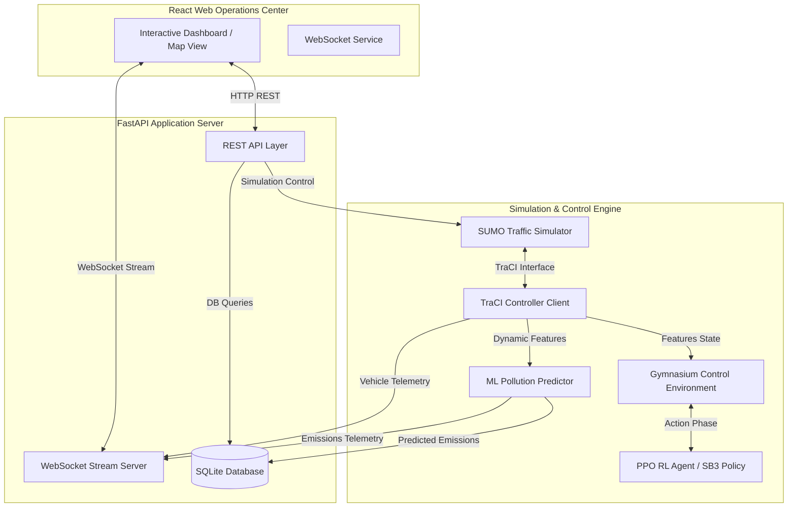

# EcoTwin
### Intelligent Urban Traffic & Carbon Intelligence Platform

EcoTwin is a production-grade, AI-powered urban digital twin that combines microscopic traffic simulation, deep reinforcement learning, machine learning, and real-time telemetry to optimize urban traffic signal schedules and study vehicular environmental impact.

---

<p align="left">
  
  
  
  
  
  
  
</p>

## Quick Navigation

*   [Overview](#overview)
*   [System Architecture](#system-architecture)
*   [Key Features](#key-features)
*   [Workflow Flowchart](#workflow-flowchart)
*   [Technology Stack](#technology-stack)
*   [Installation & Quick Start](#installation--quick-start)
*   [API Documentation](#api-documentation)
*   [Machine Learning Pipeline](#machine-learning-pipeline)
*   [Reinforcement Learning Control](#reinforcement-learning-control)
*   [Environmental Intelligence](#environmental-intelligence)
*   [Demo Sequence](#demo-sequence)
*   [Engineering Highlights](#engineering-highlights)
*   [Project Status & Roadmap](#project-status--roadmap)
*   [Contributing](#contributing)
*   [License](#license)
*   [Acknowledgements](#acknowledgements)

---

## Overview

Modern municipal traffic systems face a double-edged challenge: severe vehicular congestion that translates directly into billions of idling hours, and localized air quality degradation caused by carbon emissions (CO₂ and NOx). Conventional traffic signal control strategies—such as static fixed-time schedules or reactive inductive loop actuators—are inherently limited. They lack the spatial awareness and dynamic adaptability required to handle fluctuating urban flows and contain emissions.

**EcoTwin** bridges this gap by creating an integrated urban digital twin. By coupling **SUMO (Simulation of Urban MObility)** with **FastAPI** and **React**, EcoTwin enables real-time traffic signal phase overrides powered by a deep reinforcement learning policy (**PPO**). 

The platform connects real-time vehicle telemetry directly with a supervised machine learning model to estimate pollution in real time, exposing spatial emission hotspot metrics. It provides engineers, researchers, and operators with a glassmorphic dashboard to monitor simulation progress, switch controller models on the fly, and run what-if comparative analyses.

---

## System Architecture

The EcoTwin platform is built with a decoupled three-tier architecture:
1.  **Frontend Operations Center**: A React dashboard constructed with Vite and TypeScript. It utilizes Zustand for global client-state management, WebSockets for high-frequency telemetry rendering, and Recharts/Leaflet for real-time emission mapping.
2.  **FastAPI Application Server**: A modular asynchronous Python API that acts as the orchestration layer. It exposes endpoints to control simulation states, runs background loops, interfaces with the database, and streams JSON frames over WebSockets.
3.  **Closed-Loop Control & Simulation Engine**: The interface where SUMO is controlled dynamically via a TraCI client wrapper, utilizing Gymnasium environments to compute reinforcement learning step phases.



---

## Key Features

| Module | Capability | Verified Technical Implementation |
|---|---|---|
| **Digital Twin** | Microscopic Traffic Simulation | SUMO instance running real-world Cologne road networks (`tapas_cologne`). |
| **Traffic Control** | Signal Phase Overrides | Direct phase setting (0-3) on target traffic light junctions via TraCI. |
| **ML Intelligence** | Real-Time Pollution Predictor | Random Forest/Gradient Boosting model estimating emissions based on telemetry features. |
| **RL Controller** | Closed-Loop PPO Agent | Gymnasium env calculating multi-objective phase selections using Stable-Baselines3. |
| **Carbon Intelligence**| Hotspot Detection | Tracks vehicle-level CO₂, NOx, and fuel consumption to flag exceeding thresholds. |
| **Telemetry Layer** | High-Frequency WebSocket | Streams vehicle coordinate arrays, metrics, and traffic light statuses. |
| **Analytics Dashboard**| Comparative Evaluation | SQLite backend supporting metrics comparison of RL Agent vs. Fixed-Time baseline. |

---

## Workflow Flowchart

Below is the conceptual closed-loop workflow that guides every execution step of the EcoTwin platform:

```
 REAL-WORLD TRAFFIC NETWORK
             │
             ▼
     SUMO DIGITAL TWIN
             │
             ▼ (TraCI Telemetry)
    VEHICLE STATE FEATURE VECTOR
             │
 ┌───────────┴───────────┐
 ▼                       ▼
SUPERVISED ML MODEL     GYMNASIUM ENV
(Emissions Inference)   (State Observation)
 │                       │
 ▼ (CO₂/NOx/Fuel)        ▼ (PPO Policy Evaluation)
EMISSION HOTSPOTS       TRAFFIC SIGNAL ACTIONS
 │                       │
 └───────────┬───────────┘
             ▼
     WEBSOCKET STREAM
             │
             ▼
 GLASSMORPHIC OPERATIONS CENTER
```

---

## Technology Stack

*   **Frontend Core**: Vite + React 18.2 + TypeScript 5.0
*   **State Management**: Zustand
*   **Charts & Maps**: Recharts, Leaflet (Map rendering)
*   **Backend Server**: FastAPI 0.100+ + Uvicorn
*   **Traffic Simulation Engine**: Eclipse SUMO (Simulation of Urban MObility) 1.18+
*   **Simulation Protocol**: TraCI (Traffic Control Interface) Python Client
*   **Machine Learning (ML)**: Scikit-learn (Model evaluation via Joblib preprocessor)
*   **Reinforcement Learning (RL)**: Gymnasium, Stable-Baselines3 (PPO policy network)
*   **Database Engine**: SQLite (backed by SQLAlchemy ORM schemas)

---

## Installation & Quick Start

EcoTwin is developed and validated on Windows. Follow these steps to set up and run the complete stack locally.

### Prerequisites
*   **Python 3.10+** (Tested with Python 3.10 and 3.13)
*   **Node.js 18+** (with npm package manager)
*   **Eclipse SUMO**: Ensure SUMO is installed on your machine.
    *   Set the `SUMO_HOME` environment variable pointing to the installation directory (e.g., `C:\Program Files (x86)\Eclipse\Sumo`).
    *   Add `SUMO_HOME\bin` to your system `PATH`.

### 1. Clone the Repository
```bash
git clone https://github.com/animesh6532/EcoTwin.git
cd EcoTwin
```

### 2. Configure Environment Variables
Copy `.env.example` to create your local `.env` configuration:
```bash
copy .env.example .env
```
Open `.env` and verify that the paths match your local configuration (especially `SUMO_HOME` and `SUMO_GUI=false` if running headless).

### 3. Backend Setup
Create a virtual environment, activate it, and install Python dependencies:
```bash
# Create environment
python -m venv .venv

# Activate environment (Windows PowerShell)
.venv\Scripts\Activate.ps1

# Install requirements
pip install -r requirements.txt
```

### 4. Frontend Setup
Install npm packages in the frontend directory:
```bash
cd frontend
npm install
cd ..
```

### 5. Running the Application
To run the project, start both the backend API server and the Vite frontend client:

*   **Start the Backend Server**:
    ```bash
    python -m uvicorn backend.main:app --reload --host 127.0.0.1 --port 8000
    ```
*   **Start the Frontend Client** (in a separate terminal):
    ```bash
    cd frontend
    npm run dev
    ```

Open your browser and navigate to `http://localhost:5173` to access the EcoTwin Operations Center.

---

## API Documentation

The FastAPI backend automatically hosts interactive API documentation. When the backend is running, visit:
*   Swagger UI: [http://127.0.0.1:8000/docs](http://127.0.0.1:8000/docs)
*   Redoc UI: [http://127.0.0.1:8000/redoc](http://127.0.0.1:8000/redoc)

### Central API Endpoints

#### 1. System Health
*   `GET /api/v1/health`: Checks connections for API, SQLite database, SUMO binaries, and loaded PPO agents.
*   `GET /api/v1/ready`: Returns readiness status for platform execution.

#### 2. Simulation Control
*   `POST /api/v1/simulation/start`: Starts the SUMO simulation instance (accepts scenario type, gui configuration, and duration).
*   `POST /api/v1/simulation/pause`: Pauses active simulation running loops.
*   `POST /api/v1/simulation/resume`: Resumes paused simulation runs.
*   `POST /api/v1/simulation/step`: Triggers a manual single-step advance of the simulator.
*   `POST /api/v1/simulation/stop`: Stops the simulation and safely closes TraCI.
*   `GET /api/v1/simulation/status`: Checks active simulation metadata.

#### 3. Vehicle Telemetry
*   `GET /api/v1/vehicles`: Returns the paginated list of active vehicles in the current step (coordinates, speed, road/lane ID, emissions).
*   `GET /api/v1/vehicles/summary`: Aggregate metrics for active vehicles (total count, average speed, delay).
*   `GET /api/v1/vehicles/{vehicle_id}`: Returns coordinates and metrics for a specific vehicle.

#### 4. Environmental Emissions
*   `GET /api/v1/emissions/current`: Instantaneous CO₂, NOx, and fuel consumption values.
*   `GET /api/v1/emissions/history`: Accumulated emission values for the current running session.
*   `GET /api/v1/emissions/hotspots`: Returns a list of lane IDs exceeding safe thresholds.
*   `GET /api/v1/emissions/summary`: Spatial coordinate grid cells with pollution intensities for map rendering.

#### 5. Traffic Light Control
*   `GET /api/v1/traffic-lights`: Discovers all traffic light junction IDs in the active scenario.
*   `GET /api/v1/traffic-lights/{id}`: Returns details of a specific traffic light and its valid phase strings.
*   `POST /api/v1/traffic-lights/{id}/action`: Sends manual traffic signal phase overrides (phase index 0-3).

#### 6. Reinforcement Learning
*   `GET /api/v1/rl/status`: Checks agent controller type (`fixed_time` or `ppo`), mean rewards, and action latencies.
*   `POST /api/v1/rl/mode`: Switches the active traffic light controller in real-time (toggles between `fixed_time` and `ppo`).
*   `GET /api/v1/rl/model`: Returns metadata about the loaded PPO neural network weights (training date, model version).

#### 7. Metrics & Analytics
*   `GET /api/v1/metrics/current`: Aggregated snapshots of vehicles, delays, and emissions.
*   `GET /api/v1/metrics/history`: Fetches time-series database logs for a specific session UUID.
*   `GET /api/v1/analysis/compare`: Computes comparative analysis calculations (average delay reduction, emission cuts) between a PPO session run and a fixed-time baseline.

### WebSocket Endpoint
*   `WS /ws/simulation`: High-frequency broadcast channel streaming JSON telemetry frames to the frontend client. Broadcasts once every second when the simulation is running.
    *   **Frame Structure**:
        ```json
        {
          "type": "simulation_state",
          "simulation_time": 21605.2,
          "vehicles": [
            { "id": "veh_0", "x": 3402.1, "y": 1289.4, "speed": 45.2, "waiting_time": 12.0 }
          ],
          "traffic_lights": [
            { "id": "center_intersection", "phase": 2, "state": "rrrrrGGGggrrrrrGGGgg" }
          ],
          "metrics": {
            "vehicle_count": 142,
            "average_speed": 34.5,
            "total_waiting_time": 412.5,
            "total_co2": 15829.4
          },
          "pollution": [
            { "x": 3400.0, "y": 1280.0, "intensity": 0.85, "co2": 240.2, "vehicles": 3 }
          ]
        }
        ```

---

## Machine Learning Pipeline

EcoTwin uses a supervised learning pipeline to perform real-time vehicle-level pollution prediction:
1.  **Telemetry Inputs**: During each simulation step, the telemetry pipeline reads speed, acceleration, waiting_time, slope, and lane ID for all active vehicles.
2.  **Feature Schema**: Features are structured using the schema defined in `models/preprocessing/feature_schema.json`.
3.  **Inference Service**: The preprocessor orders and validates the features before feeding them into the trained model loaded from `models/ml/pollution_predictor.joblib` (Random Forest Regressor).
4.  **Outputs**: Predicts instantaneous CO₂ (mg/step), NOx (mg/step), and fuel consumption (ml/step) for each vehicle, mapping them to coordinates to flag spatial pollution grids.

---

## Reinforcement Learning Control

The closed-loop traffic light signal optimization utilizes a deep reinforcement learning policy:
*   **Algorithm**: Proximal Policy Optimization (PPO) implemented using PyTorch and Stable-Baselines3.
*   **Environment**: Custom Gymnasium wrapper environment (`backend/rl/environment.py`).
*   **Observation Space (8D State Vector)**:
    *   Vehicle count per lane on approach lines.
    *   Accumulated waiting times for approaching vehicles.
    *   Current traffic signal phase index.
*   **Action Space (Discrete 0-3)**:
    *   `0`: North-South Green Phase (`GGGggrrrrrGGGggrrrrr`)
    *   `1`: North-South Yellow Phase (`yyyyyrrrrryyyyyrrrrr`)
    *   `2`: East-West Green Phase (`rrrrrGGGggrrrrrGGGgg`)
    *   `3`: East-West Yellow Phase (`rrrrryyyyyrrrrryyyyy`)
*   **Reward Function**: A multi-objective penalty designed to encourage throughput while discouraging environmental pollution:
    $$\text{Reward} = - (\alpha \cdot \text{Delay Penalty} + \beta \cdot \text{Emission Penalty})$$
    Where emissions include predictions for CO₂ and NOx.
*   **Model Weights**: Checks and loads the policy parameters from `models/rl/ppo/best_model.zip`.

---

## Environmental Intelligence

EcoTwin helps operators assess carbon indices using granular metrics:
*   **CO₂ Tracking**: Instantaneous CO₂ production helps identify road sectors where traffic congestion leads to high emission peaks.
*   **NOx Index**: Evaluates toxic nitrogen oxide emissions, especially near residential/dense urban zones of the Cologne scenario.
*   **Hotspot Analysis**: Evaluates lane-level emissions against safe thresholds. Lanes exceeding the limits are flagged as hotspots, helping operators evaluate if PPO signal overrides help dissipate congestion peaks.

---

## Screenshots

Below is a visual overview of where screenshots showing the Operations Center should be added:

| View | Description | Screenshot Location |
|---|---|---|
| **Landing Interface** | Glassmorphic portal and health gateway. | `docs/screenshots/01_landing.png` |
| **Operations Center** | Real-time traffic network and control dashboard. | `docs/screenshots/02_operations.png` |
| **Spatial Carbon Map**| Leaflet projection mapping of emission intensity grids. | `docs/screenshots/03_carbon_map.png` |
| **Comparative Analytics**| Baseline vs. PPO performance charts. | `docs/screenshots/04_analytics.png` |

---

## Demo Sequence

To experience the full capability of the EcoTwin platform:
1.  **Launch the Gateway**: Open `http://localhost:5173` and verify all components show a healthy green status.
2.  **Enter Operations Center**: Click "Enter Operations Center" to view the live dashboard.
3.  **Start SUMO**: Configure the scenario settings (e.g., set to Cologne Network) and click **Start Simulation**.
4.  **Observe Telemetry**: Verify vehicle markers appear on the Leaflet map and move in real-time.
5.  **Track Emissions**: Switch to the **Carbon Intelligence** tab to observe the real-time intensity grid.
6.  **Verify Baseline**: Note the average speed and waiting time metrics under the `Fixed-Time Baseline` controller.
7.  **Activate AI Controller**: Switch the controller mode to `PPO Optimization`.
8.  **Monitor PPO Actions**: Note how the signals adapt their phases to current approach queues.
9.  **Evaluate Performance**: Open the **Analytics** tab to view comparative plots of delays and emissions.
10. **Stop Run**: Click **Stop Simulation** to close the session and commit the run data to the SQLite database.

---

## Engineering Highlights

*   **Closed-Loop Simulation Integration**: Dynamic bi-directional control of SUMO using TraCI, interfacing with Python's multiprocessing loop without thread lockups.
*   **Real-time High-Frequency Telemetry**: Multi-threaded WebSocket broadcasting streaming data frames with minimal latency.
*   **Double-Tier AI Integration**: Simultaneously running a supervised regression network for pollution prediction and a deep reinforcement learning policy for traffic phase control.
*   **Glassmorphic UI**: Dashboard styling that utilizes modern vanilla CSS variables and Tailwind utilities to deliver a visual experience.

---

## Project Status & Roadmap

### Project Status: `Active Development`

- [x] High-fidelity microscopic SUMO integration
- [x] Asynchronous FastAPI backend server
- [x] Dynamic real-time WebSockets telemetry stream
- [x] Scikit-learn pollution prediction pipeline
- [x] Stable-Baselines3 PPO RL environment integration
- [x] React client analytical interface and Leaflet mapping
- [ ] Multi-intersection spatial coordination
- [ ] Cloud deployment templates (Docker/compose orchestration)
- [ ] Advanced what-if scenario generation builder

---

## Contributing

1. Fork the repository.
2. Create your feature branch (`git checkout -b feature/AmazingFeature`).
3. Commit your changes (`git commit -m 'Add some AmazingFeature'`).
4. Push to the branch (`git push origin feature/AmazingFeature`).
5. Open a Pull Request.

---

## License

This project is licensed under the MIT License - see the [LICENSE](LICENSE) file for details.

---

## Acknowledgements

*   [Eclipse SUMO](https://www.eclipse.org/sumo/) - Microscopic traffic simulation engine.
*   [Stable-Baselines3](https://github.com/DLR-RM/stable-baselines3) - Reinforcement learning baselines.
*   [FastAPI](https://fastapi.tiangolo.com/) - Web framework.
*   [Leaflet](https://leafletjs.com/) - Open-source interactive maps.
